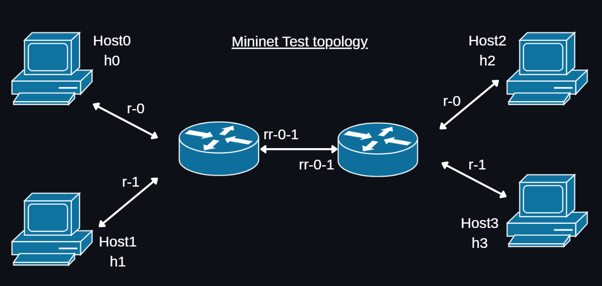
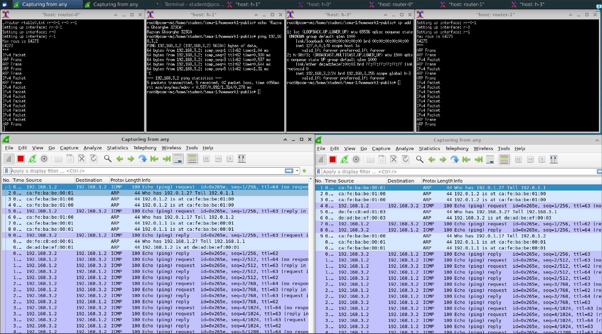
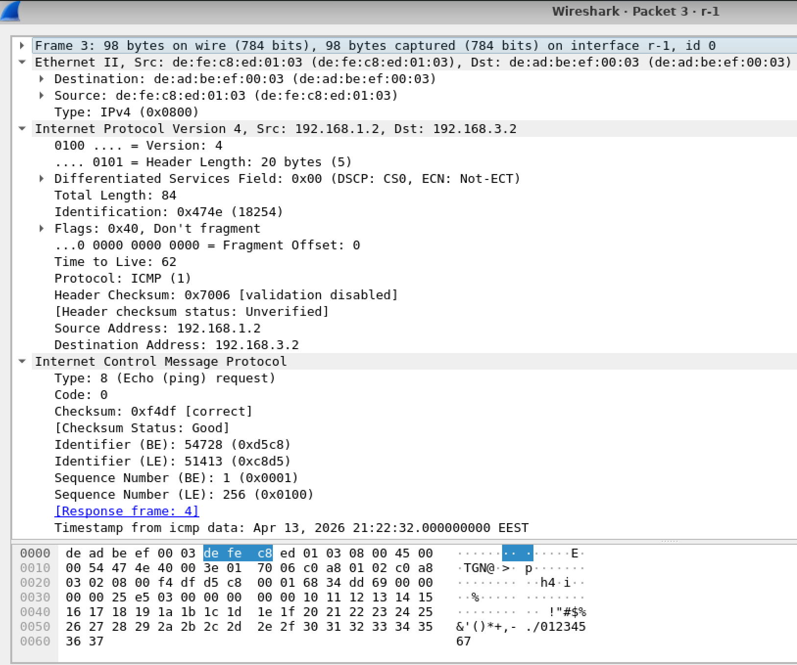
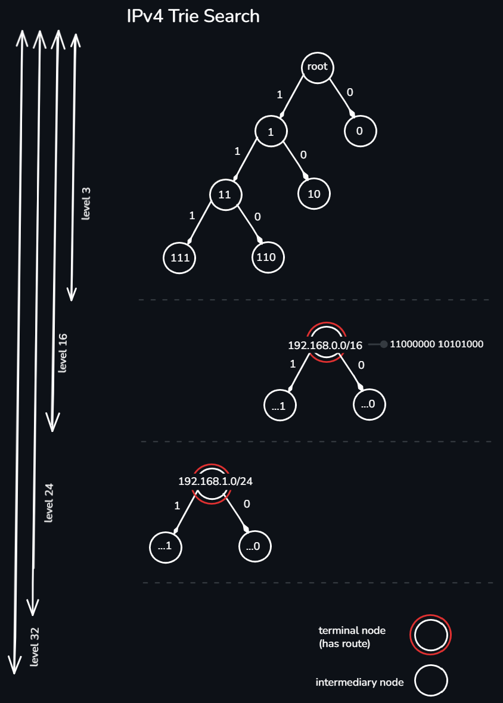
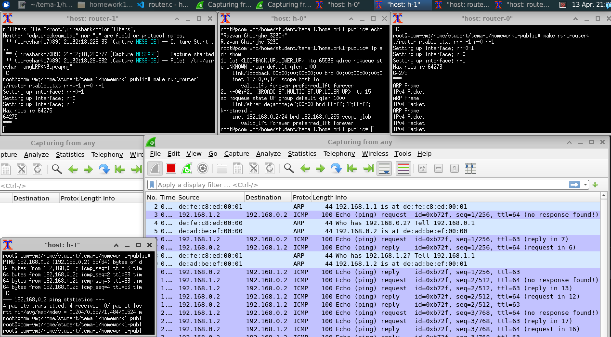
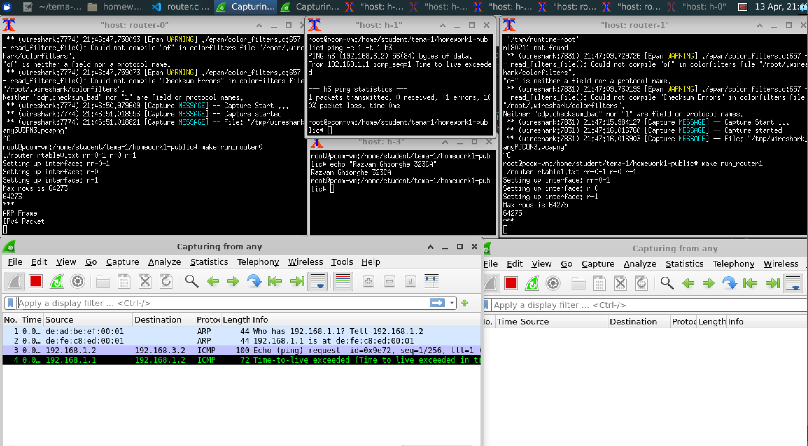
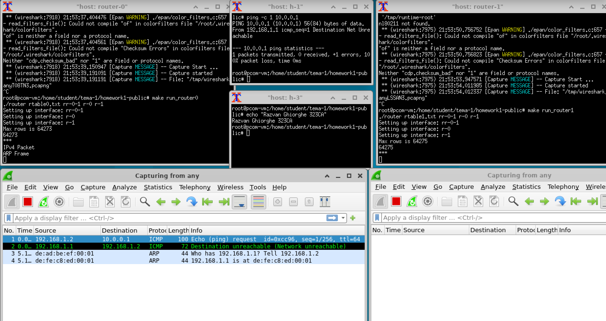
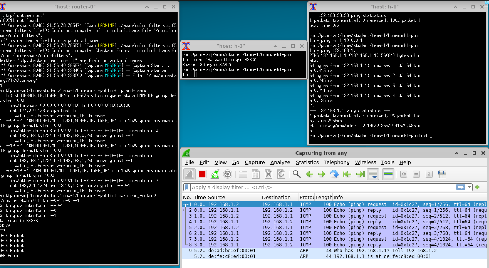

# Router Data Plane

A router has two main components:
- *Dataplane*: the component that implements the actual routing process based on entries in the routing table. It 
operates at high speed, processing each packet individually in real time.
- *Control plane*: the component that implements the distributed routing algorithms (eg. RIP, OSPF, BGP), responsible 
for calculating and populating the routing table.
This implementation covers exclusively the dataplane. The routing algorithms in the control plane are not 
implemented: the router works with a static routing table received as an input file at startup which doesn't change 
during runtime.
The router has multiple network interfaces and can receive packets on any of them. For each received packet, the 
dataplane determines the interface and the corresponding next hop based on the routing table, rewrites the Layer2 
headers and forwards the packet onward (either to a host or to another directly connected router).
Packet processing is done in an infinite loop, without blocking the router: packets for which the MAC address of the 
next hop is not yet known are saved in a queue and retransmitted after receiving the corresponding ARP response, 
stored in a cache.

### Forwarding Process
Packet forwarding is a process that operates at layer 3 (Network) of the OSI stack. When a packet is received, the 
router goes through the following steps:
- _Packet parsing_ → from the raw byte stream, the router reconstructs the data structures corresponding to the 
headers present, identifying the type and content of each field. Malformed packets (eg. too short to contain a valid 
header) are silently discarded.
- _Layer2 validation_ → the router processes only packets whose MAC destination field matches the MAC address of the 
receiving interface or the broadcast address (FF:FF:FF:FF:FF:FF). Any other Ethernet frame is ignored as it is not 
intended for this router.
- _Demultiplexing by EtherType_ → the EtherType field in the Ethernet header indicates the protocol encapsulated in 
the payload. The implementation handles two cases (defined in RFC 5342):  
**0x0800** for IPv4: packet is routed  
**0x0806** for ARP: packet is processed for MAC address resolution

Will only work with Ethernet frames that are transmitted as payload over the Ethernet physical layer protocol 
implementation. Since the CRC is calculated in hardware, it won't be found in the Ethernet header.

Any other packet type is ignored. This separation allows the router to handle IPv4 forwarding logic independently 
from ARP handling, keeping the code modular and extensible (for example, adding IPv6 support (0x86DD) would only 
require a new processing block in the same switch).

#### IPv4
Upon receiving an IPv4 packet the router goes through the following steps:
1. Destination Check: if the destination IP address belongs to the router, the packet is not forwarded, but processed 
locally (in this implementation, the router only responds to ICMP Echo Request).
2. Checksum Validation: the IP header checksum is recomputed and compared to the one received; a mismatch indicates 
corruption and the packet is dropped.
3. TTL Check and Decrement: packets with TTL ≤ 1 are dropped, and an ICMP Time Exceeded message is sent to the 
sender. Otherwise, the TTL is decremented and the checksum is recomputed.
4. Longest Prefix Match (LPM): the router searches the routing table for the most specific route for the destination 
address, applying `ip.dest & entry.mask == entry.prefix`. If no route exists, the packet is dropped and an ICMP 
Destination Unreachable is sent to the sender.
5. L2 rewrite and forward: MAC addresses are rewritten (source = router output interface, destination = next hop MAC 
determined via ARP) and the packet is sent on the appropriate interface.

#### ARP
After determining the next hop via LPM the router must encapsulate the packet in an Ethernet frame with the correct 
next hop MAC address. This address is not statically known, but is resolved dynamically using the ARP protocol (RFC 
826).
- ARP Cache
The router maintains an ARP cache of up to 256 entries which is searched before any network query. If the next hop 
MAC address is already known, the packet is forwarded immediately without any additional query.This caching mechanism 
eliminates latency and additional traffic for consecutive packets to the same destination.
- Waiting Packet Queue
If the MAC address is not in the cache the packet is not dropped, but it's saved in a queue (allocated dynamically, 
malloc'ed per packet to avoid buffer overwriting). The router then sends an ARP request broadcast on the interface 
corresponding to the next hop and continues to process other packets without blocking.
- ARP request processing
Upon receiving an ARP request intended for the router (broadcast or unicast to its interface) the router constructs 
and sends a unicast ARP reply with its own MAC address.
- ARP reply processing
Upon receiving an ARP reply the router updates its cache and scans the entire queue of waiting packets, sending all 
packets whose next hop matches the IP in the reply. Packets with no match remain in the queue for a later reply.

The ARP cache is permanent during runtime meaning that entries do not expire. In a production implementation, each 
entry would have a timestamp and would be invalidated after approx. 20 minutes according to RFC 1122. Also, if an ARP 
reply never arrives the packets remain in the queue indefinitely. May include ARP retransmission and timeout with 
ICMP Destination Unreachable to the sender.

#### ICMP

ICMP (source RFC 792) is a control protocol for InternetProtocol located above it in the protocol stack. It is not a 
transport protocol: it does not deliver data between applications but rather transmits diagnostic and error 
information between routers and hosts.
The router generates ICMP error messages in two situations, both of which construct a packet containing the original 
IP header plus the first 64 bits of the payload of the dropped packet (according to RFC 792):

| Type | Notes |
| -------- | -------- |
|  Time Exceeded (type 11, code 0) |  sent to the sender when a packet is dropped due to TTL expiration. Useful for diagnostics (basis for the traceroute utility).  |
| Destination Unreachable (type 3, code 0) | sent when the router cannot find any route for the destination address in its routing table. |
| Echo Request/Reply | The router, being an entity with IP addresses itself can be the destination of an ICMP Echo Request (type 8, code 0) generated by `ping`. In this case, the router does not forward the packet but constructs and sends back an Echo Reply (type 0, code 0), leaving the id, seq, and original payload fields unchanged (their interpretation is up to the sending host). |

All error messages are constructed from scratch in a separate buffer with a new Ethernet header (MAC addresses 
reversed), a new IP header (source = router interface IP, TTL = 64), and the ICMP header followed by the original IP 
header plus 8 bytes of the payload. The checksum is recalculated for both IP and ICMP before sending.
## Test

<table>
<tr>
<td>

Mininet Topology used for testing

</td>
<td>

</td>
</tr>
</table>

The implementation is tested using **_Mininet_**, a network emulator that creates virtual topologies using real Linux 
kernel functionalities (network namespaces, veth pairs). Unlike a simulator, Mininet runs real code on virtual hosts 
and routers, providing a faithful environment to a real deployment.
The topology used consists of 4 hosts (h0 to h3) and 2 routers (router-0, router-1) connected in such a way that 
packets between h0/h1 and h2/h3 necessarily traverse both routers allowing testing of multi-hop forwarding.
The router is implemented as a userspace process that accesses the network interfaces through the API provided by lib.
h: an abstraction over raw layer 2 sockets. The `recv_from_any_link()` and `send_to_link()` functions allow the 
reception and transmission of raw Ethernet frames on any interface, without involving the OS's network stack. This 
approach reflects the architecture of a real dataplane, where packet processing is done independently of the OS 
internals.

 

 

**_First Scenario_**: h3 (192.168.3.2) pings h1 (192.168.1.2) and packets are traversing router-1 and router-0

* ICMP packets appear twice on each router (captured on both interfaces, incoming and outgoing), which confirms that the router processed and retransmitted the packet.
* TTL = 62 on request (decremented 2 times, one router at a time) and TTL = 64 on reply, which confirms correct decrementation.
* The dynamic ARP is visible: On the first packet, ARP request/reply appear before ICMP routers did not know the MAC addresses and resolved them dynamically.
* Subsequent packets no longer generate ARP so the cache works
0% packet loss means all 3 packets arrived and returned, confirmed by `3 packets transmitted, 3 received, 0% packet loss`
 

 

**_Second Scenario_**: Ping from h0 (192.168.1.2) to h1 (192.168.0.2). The router must choose the correct route from the routing table. 
<table>
<tr>
<td>

The fact that the packet correctly reaches h1 and not another destination proves that the LPM worked 
correctly, it chose the prefix 192.168.0.0/24 and not a less specific route.
The routing table has 64273 entries (visible in the router-0 terminal: Max rows is 64273) and at this size linear 
search would average 32000 entries per packet, while the trie finds the answer in a maximum of 32 steps regardless of 
the table size. During the search, the algorithm traverses the trie bit by bit (MSB first), 
keeping track of the last terminal node encountered. The image shows the trie structure.
The trie is built only once at startup, before the processing loop.

</td>
<td>

</td>
</tr>
</table>
 

 

**_Third Scenario_**:
- ICMP Time Exceeded (type 11, code 0)
`ping -c 1 -t 1 h3` from h1: packet goes out with TTL=1, router receives it, sees TTL≤1, drops it and sends back "Time Exceeded". Visible in Wireshark: line 3 shows ICMP Echo request with TTL=1, line 4 shows Time-to-live exceeded response from 192.168.1.1 (router interface). Terminal h1 confirms: From 192.168.1.1 icmp_seq=1 Time to live exceeded

- ICMP Destination Unreachable (type 3, code 0)
`ping -c 1 10.0.0.1` from h1: address that does not exist in the routing table. Router does LPM lookup, finds no route and sends Destination Unreachable. Visible in Wireshark: line 1 shows Echo request to 10.0.0.1, line 2 shows Destination unreachable (Network unreachable) from 192.168.1.1. Terminal h1 confirms: Destination Net Unreachable.

- ICMP Echo Reply (type 0, code 0)
`ping 192.168.1.1` from h1: the router interface IP, so the packet is destined for the router itself. The router does not forward, but responds locally. Visible in Wireshark: request and reply alternate perfectly, TTL=64 on reply (set by router), id and seq kept identical. Terminal h1 confirms: 4 packets transmitted, 4 received, 0% packet loss
